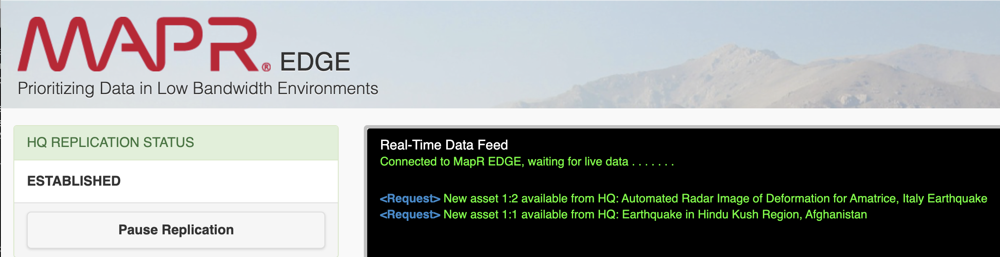

**OVERVIEW**

This section describes how to create the demo that was shown on [BrightTalk](https://www.brighttalk.com/webcast/12641/445912/stretching-hpe-ezmeral-data-fabric-from-edge-to-cloud) (demo starts around 32 mins 10 seconds).

```diff
- The concepts demonstrated in this project are not suitable for production environments.
- This project is for frequently creating and tearing down demo/trial environments.
- This project is not for creating and managing long-living demo/trial environments.
- Please read the project license before using this project.
```

### Pre-requisites

The following installed locally:

 - Terraform - [installation instructions](https://learn.hashicorp.com/terraform/getting-started/install.html)|[downloads](https://www.terraform.io/downloads.html)
 - AWS CLI - [installation instructions](https://docs.aws.amazon.com/cli/latest/userguide/cli-chap-install.html)

This project has been tested on **Linux** and **OSX** client machines - Windows is unlikely to work.


### Setup project environment

```
# If you haven't already configured the aws CLI with your credentials, run the following:
aws configure

# clone this project
git clone https://github.com/hpe-container-platform-community/df-edge-demo-terraform
cd df-edge-demo-terraform

# create a copy 
cp ./etc/bluedata_infra.tfvars_example ./etc/bluedata_infra.tfvars

# edit to reflect your requirements - read the comments in the file!
vi ./etc/bluedata_infra.tfvars 

# initialise terraform
terraform init
```

---

### AWS infrastructure setup

```
./bin/terraform_apply.sh # answer yes when prompted
```

### Install MAPR

```
./scripts/mapr_install_clusters_parallel.sh
./scripts/mapr_verify_install.sh
```

### Setup Cross-Cluster security

```
./scripts/mapr_setup_cross_cluster_security.sh
```


### Register License

- This requires an account on https://mapr.com/user - create one if you don't have one already.
```
./scripts/register_license.sh
```
- Enter mapr.com credentials when prompted

- Verify the license with (ensure the expiry date is set and has not passed):
```
./scripts/verify_license.sh
```

- if this step fails, manually register the license in the MCS UI - you can retrieve the MCS UI with `./bin/mapr_edge_demo_urls.sh` (mapr/mapr)


### Setup Edge Demo

```
./scripts/setup_edge_demo.sh
```

---

## Run the demo

### Run Dashboards


- Open a New terminal, then run

```
./bin/mapr_edge_demo_start.sh
```

An error similar to the following indicates the enterprise license has not been applied to the clusters:

> ERROR (95) -  Failed to add replica for table: /apps/pipeline/data/replicatedStream DirectCopyInfo DC_NOT_SUPPORTED
> 2021-01-22 09:58:35,5813 ERROR Client fc/dbclient.cc:716 Thread: 2411 AddTableReplica failed, error Function not implemented(38)

### Setup Mirroring, Replication, etc

- Open a New terminal, then run

```
./bin/mapr_edge_demo_poststartup.sh
```


### Open dashboards

```
./bin/mapr_edge_demo_urls.sh
```

You should see the EDGE dashboard reporting the replication status as 'ESTABLISHED':



### Restart Volume Mirror

- After requesting assets on the Edge dashboard, restart mirroring with

```
./bin/mapr_edge_demo_restart_vol_mirror.sh
```

### Monitor Mirroring

- Monitor DC files

Open a new terminal and run:

```
./bin/mapr_edge_demo_watch_mirror.sh
```

---

### Start/Stop the EC2 instances

Stop ...

```
./bin/ec2_stop_all_instances.sh
```

Start ...

```
./bin/ec2_start_all_instances.sh
```

After starting the instances you need to repeat the steps to [run the demo](#run-the-demo).

### EC2 instance status

```
./bin/ec2_instance_status.sh
```

### SSH into EC2 instances

```
./bin/ssh_mapr_cluster_1_host_0.sh
./bin/ssh_mapr_cluster_1_host_1.sh
./bin/ssh_mapr_cluster_1_host_2.sh
./bin/ssh_mapr_cluster_2_host_0.sh
./bin/ssh_mapr_cluster_2_host_1.sh
./bin/ssh_mapr_cluster_2_host_2.sh
```

### Teardown the environment

```
./bin/terraform_destroy.sh # answer yes when prompted
```
